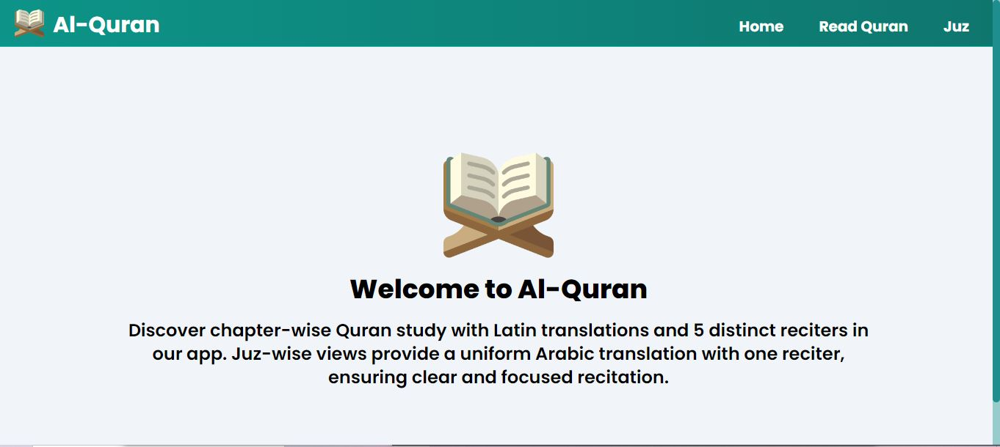

# Al Quran



## Overview

Al Quran is a web app designed to enrich your spiritual journey by providing various features aimed at facilitating Quran reading, recitation, and navigation.

### Features

🔹 **Chapter-wise Reading**: Access each chapter of the Quran with verses available in both Arabic and Latin translations.

🔹 **Diverse Recitations**: Choose from 5 distinct reciters for chapter-wise translations, offering variety and personalization to your Quranic experience.

🔹 **Juz-wise Navigation**: A more focused approach with access to Juz-wise sections that include only the Arabic translation and one reciter.

### Built With

- **React**: For a modern, dynamic UI.
- **Tailwind CSS**: For sleek, responsive designs.
- **Redux**: For state management across components.
- **GSAP**: For smooth animations and transitions.
  
The app is fully responsive, ensuring a seamless experience on both mobile and desktop devices.

## Future Enhancements

I’m committed to continuously improving Al Quran with new features and updates. Stay tuned for more exciting developments!

---

### How to Run the Project

1. Clone the repository:
    ```bash
    https://github.com/Arham097/Quran-App.git
    ```

2. Install dependencies:
    ```bash
    npm install
    ```

3. Start the development server:
    ```bash
    npm run dev
    ```

4. Access the app at:
    ```bash
    http://localhost:5173
    ```

---

### License

This project is open-source and available under the [MIT License](LICENSE).

